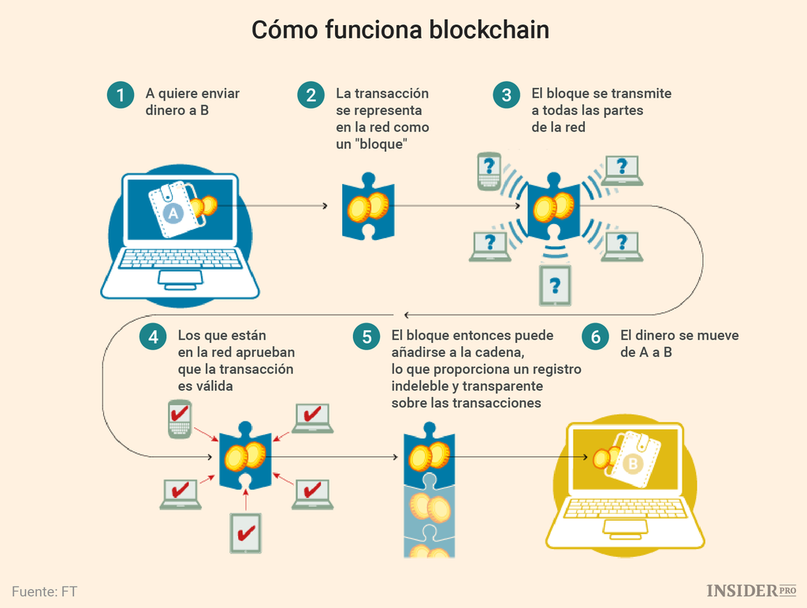

# blockchain-P8

# ¿ Que es Blockchain ?

Blockchain es una estructura de datos cuya información se agrupa en conjuntos (bloques) a los que se les añade metainformaciones relativas a otro bloque de la cadena anterior en una línea temporal. De esta forma, gracias a técnicas criptográficas, la información contenida en un bloque solo puede ser repudiada o editada modificando todos los bloques posteriores. Esta propiedad permite su aplicación en un entorno distribuido de manera que la estructura de datos blockchain puede ejercer de base de datos pública no relacional que contenga un histórico irrefutable de información.

# ¿ Como funciona Blockchain ?

